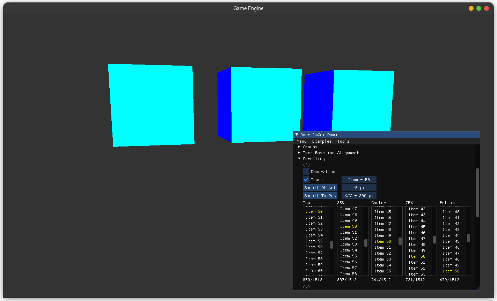

# C++ Game Engine

### Features
- Vulkan rendering engine
- ECS architecture powered by ENTT
- IMGUI support
- C++ package manager written in Go

### Developing & Building

Run `go run build.go` to generate a `CMakeLists.txt`. Then use your favorite editor of choice!